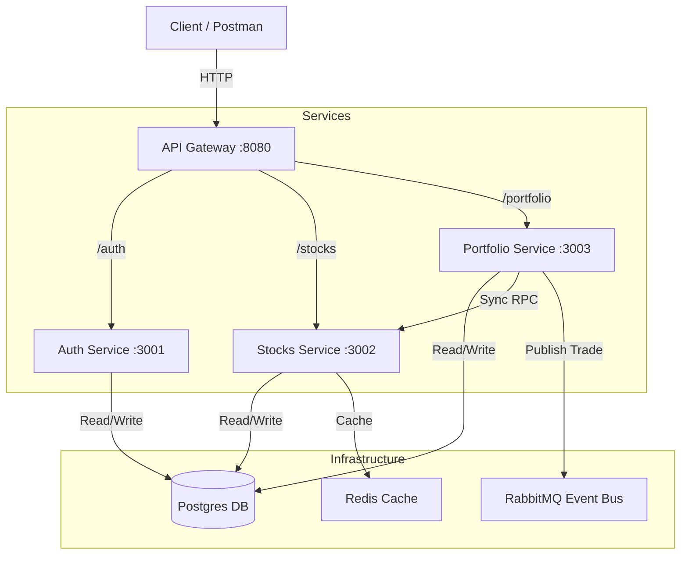

# Stocks Platform Microservices

A full-stack microservices backend for a stocks platform, built with Node.js, Express, TypeScript, Docker, Postgres, Redis, and RabbitMQ.

A full-stack microservices backend for a stocks platform, built with Node.js, Express, TypeScript, Docker, Postgres, Redis, and RabbitMQ.

## Architecture



## Tech Stack & Decisions

| Technology | Role | Why we chose it |
|------------|------|-----------------|
| **Node.js & Express** | Runtime & Framework | Event-driven architecture fits microservices perfectly. Lightweight and huge ecosystem. |
| **TypeScript** | Language | Type safety is critical when sharing interfaces (`@stocks-app/common`) across services. Catches bugs at compile time. |
| **Docker** | Containerization | Ensures consistent environments (Dev vs Prod). Easy to spin up the entire stack with one command. |
| **Postgres** | Database | Reliable, ACID-compliant relational database. Easy to manage multiple logical databases for service isolation. |
| **Prisma** | ORM | Best-in-class TypeScript support. Auto-generated types ensure DB queries match our code models. |
| **Redis** | Caching | In-memory speed for the **Stocks Service**. Market data is read-heavy; caching reduces DB load and latency. |
| **RabbitMQ** | Message Broker | Decouples services. The **Portfolio Service** publishes events (e.g., `TradeExecuted`) asynchronously, ensuring trade processing doesn't block notifications or analytics. |

| **Gateway** | 8080 | - | Entry point, Auth verification, Routing |
| **Auth** | 3001 | auth_db | User registration, Login (JWT) |
| **Stocks** | 3002 | stocks_db | Stock management, Quotes, Caching (Redis) |
| **Portfolio** | 3003 | portfolio_db | Holdings, Trades, Events (RabbitMQ) |

## Quick Start

1. **Clone & Setup**:
   ```bash
   git clone <repo>
   cd stocks-platform
   ```

2. **Run with Docker Compose**:
   ```bash
   docker-compose up --build
   ```
   *This starts Postgres, Redis, RabbitMQ, and all 4 services.*
   *First run may take a moment to build images and initialize databases.*

3. **Verify**:
   The API Gateway is available at `http://localhost:8080`.

## API Usage

### Auth
- **Register**: `POST /auth/register` { email, password }
- **Login**: `POST /auth/login` { email, password } -> Returns `token`

### Stocks
- **Create Stock**: `POST /stocks` { symbol, name }
- **Add Quote**: `POST /stocks/:symbol/quote` { price }
- **Get Quote**: `GET /stocks/:symbol/quote`

### Portfolio
*Requires Header: `Authorization: Bearer <token>`*
- **Buy Stock**: `POST /portfolio/trade` { symbol, shares: 10, action: "BUY" }
- **Get Portfolio**: `GET /portfolio`

## Architecture & Benefits

### Monolith to Microservices
This project demonstrates the migration from a monolithic design to microservices:

1.  **Scalability**:
    - **Monolith**: Scaling requires duplicating the entire application.
    - **Microservices**: We can scale just the `stocks-service` (read-heavy, cacheable) or `portfolio-service` (write-heavy) independently using Docker Swarm or Kubernetes.

2.  **Fault Isolation**:
    - If the `stocks-service` crashes, users can still log in and view their portfolio (cached data might be stale, but the app doesn't die).

3.  **Technology Diversity**:
    - Each service deals with its own database (`auth_db`, `stocks_db`, `portfolio_db`). In a real scenario, `stocks-service` could use a Time-Series DB instead of Postgres without affecting Auth.

4.  **Deployment**:
    - Updates to `auth-service` don't require redeploying the trading engine.

### Async Communication
- **RabbitMQ** is used to decouple the Portfolio service from downstream consumers (e.g., Notification Service, Analytics) via the `TradeExecuted` event.
